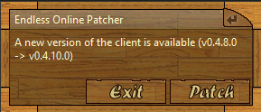
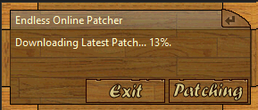

# Endless Online Patcher 🌙

This is a tool for patching [Endless Online](https://endless-online.com) because the developers were so rude as to come back after 10+ years and start working on it again 😂

# How it works

This tool fetches the latest page from the [official client download page](https://www.endless-online.com/client/download.html) and uses a regular expression to extract the version of the game client and compares it to what you have installed locally. 

This tool gets the installed location of Endless online either by checking the parent folder to the tool (e.g. This tool would install to `Endless Online/Patcher` if you were to use the installer provided) or if there is no Endless.exe in the parent folder, it defaults to `C:/Program Files (x86)/Endless Online/` as the install directory for the game.

If your local version is older than the most recent version according to the client download page, then you will get the option to patch which will download the .zip archive of the latest version, extract it to a temporary directory, and then copy all the files across to the install location (except the config) and then give you the option to launch the game.

# Features

* Automatic pickup of new version available
* Automatic patching
* Ability to launch the game directly from the patcher
* UI fits the theme of the game
* Ignores the downloaded config so it doesn't overwrite the config you have locally

# Todo
* EO Directory picker
    * Optional: Save this in some sort of config so it wouldn't need to be reset on every load
* Checkbox for auto-launching the application after patch or if patching is not necessary 
    * Optional: Save this in some sort of config so it wouldn't need to be reset on every load
* Tests???